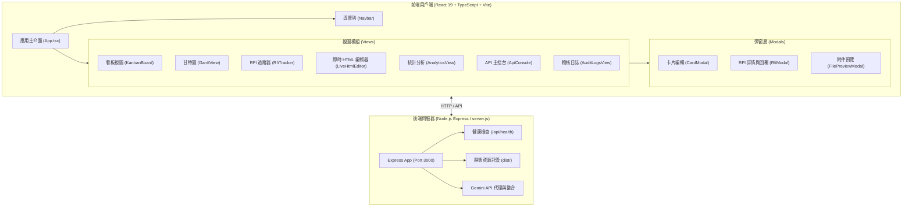

# 系統設計文件 (DESIGN.md)

本文件定義「**專案管理與 RFI 追蹤系統 (Project Management & RFI Tracking System)**」之系統架構、模組切分、資料模型、狀態管理與設計規範。

---

## 1. 系統目標與定位

本系統專為工程專案、敏捷開發與跨角色（管理員、PM、工程成員、業主/客戶）協同作業所設計，核心價值包含：
1. **敏捷看板 (Kanban Board)**：直觀的任務欄位流轉、WIP 限制警示、細部檢查清單與優先級標記。
2. **工程 RFI 資訊需求單 (Request For Information)**：標準化工程疑義提報、指定審核人員、正式裁決回覆與討論串追蹤。
3. **甘特圖時程檢視 (Gantt Scheduling)**：直觀呈現任務時程、階段分類、起訖日期與依據檢查清單計算之進度百分比。
4. **即時 HTML 工作室 (Live HTML Studio)**：支援任務成果的 HTML/CSS 即時編輯、雙向即時預覽、剪貼簿貼圖與程式碼嵌入。
5. **多角色權限 (RBAC)**：支援 `admin`、`pm`、`member`、`client` 權限隔離。
6. **稽核日誌 (Audit Trail)**：關鍵操作全流程記錄，確保工程疑義與進度變更的可追溯性。

---

## 2. 整體架構與技術棧

### 2.1 技術棧選擇

| 層級 | 技術選型 | 說明 |
| :--- | :--- | :--- |
| **前端核心** | React 19 + TypeScript (5.8+) | 高效能宣告式 UI、嚴格型別定義 |
| **建置工具** | Vite 6 | 極速熱重載 (HMR)、最佳化生產打包 |
| **樣式系統** | Tailwind CSS v4 (`@tailwindcss/vite`) | 最新原生 CSS 變數支援、現代化 Utility-First 樣式 |
| **圖標庫** | Lucide React | 一致性現代幾何圖示 |
| **動畫效果** | Motion (`motion`) | 流暢微互動與模態窗過渡 |
| **圖表可視化** | Recharts 3 | 統計儀表板與狀態分佈圖形化呈現 |
| **本機後端** | Express 4 + Node.js (ESM) | 本地託管、API 代理、健康檢查與靜態資源支援 |
| **AI 整合** | `@google/genai` (Gemini API) | 支援伺服器端與用戶端 AI 輔助分析能力 |

### 2.2 系統架構圖 (Mermaid)

---

## 3. 核心資料模型 (Data Models)

核心型別定義於 [`src/types.ts`](file:///c:/%E6%96%B0%E5%A2%9E%E8%B3%87%E6%96%99%E5%A4%BE%20%282%29/2026260911.coding-sample/src/types.ts)：

### 3.1 使用者與權限 (User & Role)
- **角色定義**：`admin` (管理員), `pm` (專案經理), `member` (工程團隊成員), `client` (業主/客戶)。
- **User 實體**：包含 `id`, `name`, `email`, `avatar`, `role`, `title`, `department`。

### 3.2 任務看板與卡片 (Board, Column & Card)
- **Board**：包含多個自訂欄位 (`Column`)，支援設定 WIP 最大卡片限制 (`maxCards`)。
- **Card**：
  - 基本屬性：`id`, `boardId`, `columnId`, `title`, `description`, `priority` (`low` | `medium` | `high` | `urgent`)。
  - 時程與分類：`startDate`, `dueDate`, `phase` (工程階段), `tags`。
  - 協同：`assignees` (負責人清單), `checklist` (檢查項目與完成狀態)。
  - 交付物：`htmlSnippet` (嵌入之 HTML/SVG/互動成果), `attachments` (關聯檔案清單)。
  - 關聯：`rfiId` (雙向綁定工程 RFI 單號)。

### 3.3 資訊需求單 (RFI)
- **RFI 實體**：
  - 編號：`rfiNumber` (如 `RFI-2026-001`)。
  - 類別 (`category`)：`design_change` (設計變更), `spec_query` (規格疑義), `schedule_impact` (工期影響), `cost_impact` (造價影響)。
  - 狀態流程 (`status`)：`draft` ➔ `submitted` ➔ `under_review` ➔ `answered` ➔ `closed`。
  - 權責分配：`raisedBy` (提報人), `assignedTo` (指定審查答覆人)。
  - 時效控管：`dueDate`, `requiredResponseDate` (要求答覆期限)。
  - 結論：`officialAnswer`, `answeredBy`, `answeredAt`。
  - 雙向追蹤：`linkedCardId` (關聯看板卡片)。
  - 歷程與留言：`thread` (含 `isOfficial` 標記、附件與時間戳)。

### 3.4 附件與檔案管理 (Attachment)
- 統一資料結構，支援 `entityType: 'Card' | 'RFI'`。
- 具備檔案型態識別 (`image`, `pdf`, `doc`, `code`, `other`)、Base64 預覽支援與容量統計。

### 3.5 稽核與通知 (ActivityLog & AppNotification)
- **ActivityLog**：操作不可篡改記錄，記錄實體類型、動作、詳細更動、操作者與時間戳。
- **AppNotification**：即時通知系統，包含 `@mention`、任務指派、RFI 狀態更迭與系統訊息。

---

## 4. 前端模組架構與職責

| 模組檔案 | 所在目錄 | 核心職責 |
| :--- | :--- | :--- |
| `App.tsx` | [`src/App.tsx`](file:///c:/%E6%96%B0%E5%A2%9E%E8%B3%87%E6%96%99%E5%A4%BE%20%282%29/2026260911.coding-sample/src/App.tsx) | 全域狀態管理 (Single Source of Truth)、分頁導航、跨模組事件派發 |
| `Navbar.tsx` | [`src/components/Navbar.tsx`](file:///c:/%E6%96%B0%E5%A2%9E%E8%B3%87%E6%96%99%E5%A4%BE%20%282%29/2026260911.coding-sample/src/components/Navbar.tsx) | 頂部導航、視圖切換 (Tab)、全域搜尋、快速切換登入身分與通知下拉選單 |
| `KanbanBoard.tsx`| [`src/components/KanbanBoard.tsx`](file:///c:/%E6%96%B0%E5%A2%9E%E8%B3%87%E6%96%99%E5%A4%BE%20%282%29/2026260911.coding-sample/src/components/KanbanBoard.tsx) | 敏捷看板視圖、卡片拖曳移動、欄位卡片上限 (WIP) 警示、過濾器 (優先級/階段) |
| `GanttView.tsx` | [`src/components/GanttView.tsx`](file:///c:/%E6%96%B0%E5%A2%9E%E8%B3%87%E6%96%99%E5%A4%BE%20%282%29/2026260911.coding-sample/src/components/GanttView.tsx) | 甘特圖時程渲染、階段分組收合、進度條即時計算、超期任務警示 |
| `RfiTracker.tsx` | [`src/components/RfiTracker.tsx`](file:///c:/%E6%96%B0%E5%A2%9E%E8%B3%87%E6%96%99%E5%A4%BE%20%282%29/2026260911.coding-sample/src/components/RfiTracker.tsx) | RFI 清單表格與卡片檢視、狀態分類標籤、即將到期倒數提示、匯出報告 |
| `LiveHtmlEditor.tsx`| [`src/components/LiveHtmlEditor.tsx`](file:///c:/%E6%96%B0%E5%A2%9E%E8%B3%87%E6%96%99%E5%A4%BE%20%282%29/2026260911.coding-sample/src/components/LiveHtmlEditor.tsx) | 即時 HTML 編輯器 (雙欄或預覽)、沙盒 iframe 隔離渲染、範本插入、回存至卡片 |
| `AnalyticsView.tsx` | [`src/components/AnalyticsView.tsx`](file:///c:/%E6%96%B0%E5%A2%9E%E8%B3%87%E6%96%99%E5%A4%BE%20%282%29/2026260911.coding-sample/src/components/AnalyticsView.tsx) | Recharts 視覺化分析、任務完成率、RFI 類別分佈、時程健康度分析 |
| `CardModal.tsx` | [`src/components/CardModal.tsx`](file:///c:/%E6%96%B0%E5%A2%9E%E8%B3%87%E6%96%99%E5%A4%BE%20%282%29/2026260911.coding-sample/src/components/CardModal.tsx) | 任務卡片全功能編輯彈窗：檢查項目勾選、HTML 預覽、剪貼簿圖片粘貼、附件上傳 |
| `RfiModal.tsx` | [`src/components/RfiModal.tsx`](file:///c:/%E6%96%B0%E5%A2%9E%E8%B3%87%E6%96%99%E5%A4%BE%20%282%29/2026260911.coding-sample/src/components/RfiModal.tsx) | RFI 專案疑義答覆與正式審批彈窗、討論串即時交流、附件檢視 |
| `FilePreviewModal.tsx` | [`src/components/FilePreviewModal.tsx`](file:///c:/%E6%96%B0%E5%A2%9E%E8%B3%87%E6%96%99%E5%A4%BE%20%282%29/2026260911.coding-sample/src/components/FilePreviewModal.tsx) | 圖片、PDF、文件與程式碼之全螢幕預覽視窗 |

---

## 5. UI/UX 設計風格原則

1. **設計語彙**：現代高質感工程科技風格（Dark Mode 灰黑漸層底色搭配精準 Accent Color）。
2. **顏色標記規範**：
   - **優先級 (Priority)**：
     - Urgent: 鮮明紅色 `#EF4444` / `rose-500`
     - High: 橙色 `#F97316` / `orange-500`
     - Medium: 藍色 `#3B82F6` / `blue-500`
     - Low: 灰色 `#64748B` / `slate-500`
   - **RFI 狀態**：
     - Draft: 灰色 `slate`
     - Submitted: 藍色 `blue`
     - Under Review: 紫色 `amber/purple`
     - Answered: 綠色 `emerald`
     - Closed: 深灰或靛藍
3. **微互動**：使用 `motion` 實現卡片拖曳與彈窗展開/淡入效果，按鈕皆具備 Focus 狀態與 Hover 回饋。
4. **無障礙 (A11y)**：維持色彩對比度，所有按鈕與互動元素具備明確的 `aria-label` 與焦點管理。

---

## 6. 安全性與擴充性考量

1. **HTML 即時預覽隔離**：
   - 預覽區塊必須限制在 `sandbox="allow-scripts"` 的 `iframe` 中執行，避免腳本跨域逃逸污染主應用程式 DOM。
2. **本機伺服器與行程管理**：
   - `server.js` 自動寫入 `.server.pid`，支援本機一鍵透過批次檔安全啟動與優雅退出 (`SIGINT`/`SIGTERM`)。
3. **擴展架構 (未來展望)**：
   - 支援後續接入真實關聯式資料庫 (PostgreSQL / SQLite)。
   - 提供 WebSocket 或 SSE 支援多用戶協同即時游標與更新廣播。
